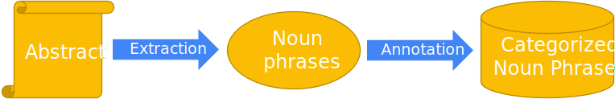
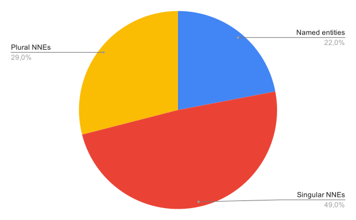
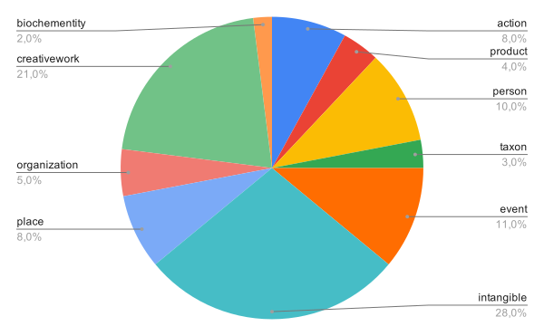
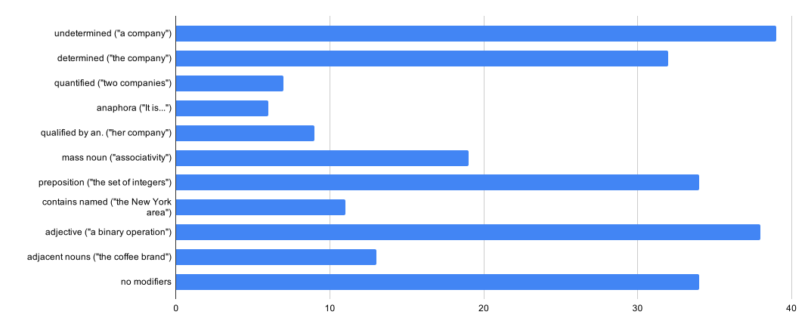

# Non-Named Entities – The Silent Majority

This is a joint work between [Pierre-Henri Paris](https://phparis.net) and 
<a href="https://suchanek.name" target="_blank">Fabian M. Suchanek</a> (both at <a href="https://www.telecom-paris.fr/en/home" target="_blank">Télécom Paris</a>,
<a href="https://dig.telecom-paris.fr/blog/" target="_blank">DIG
team</a>).

 

## Non-Named Entities?
            
Human texts usually contain a lot of <a
href="https://en.wikipedia.org/wiki/Noun_phrase#:~:text=A%20noun%20phrase%2C%20or%20nominal,most%20frequently%20occurring%20phrase%20type."
target="_blank">noun phrases</a> that often function as verb subjects and objects, as predicative
expressions and as the complements of prepositions.
When building knowledge bases, proper nouns in noun phrases are extracted and used as entities equipped
with facts to populate knowledge bases.
During this process, noun phrases that are not proper nouns are left
unmapped, thus ignoring a vast
amount of information.
Consider the following example which contains a named entity and two
non-named entities:

<blockquote><i class="e">« This is a named entity, e.g. on Wikidata.">The
<a href="https://www.wikidata.org/wiki/Q33761" target="_blank" style="color:red">Arab
Spring</a> resulted in
contentious battle between a consolidation of power by
religious elites and the growing support for
democracy. »</i>
</blockquote>

 

### The Problem

The previous example contains a lot of information that will not be extracted despite
its importance.
Indeed, the two non-named entities explain the Arab Spring event, but will not be mapped to the
knowledge bases.

In this position paper:

1. We manually analyzed this phenomenon in 30 Wikipedia abstracts,
allowing us to quantify the information lost,
1. We also proposed a partial solution for simple non-named entities,
1. Finally, we discuss the remaining challenges to represent all
non-named entities.

 

## Manual Study of Non-Named Entities in Wikipedia

We conducted a manual analysis of the noun phrases in Wikipedia articles.
Our choice is motivated by the fact that Wikipedia is a widely used standard
reference, in both research and industry applications.

We focus on the Wikipedia articles with highest quality (the “<a
href="https://en.wikipedia.org/wiki/Wikipedia:Featured_articles" target="_blank">featured
articles</a>”).

 

<figure class="figure">

<figcaption class="figure-caption">Figure 1: Annotation workflow.
</figcaption>
</figure></a>

 

We choose one article from each of the 30 topics, and automatically
extract (and manually verify) noun
phrases from the abstract of the article.
We consider noun phrases that are sequences of nouns, adjectives, adverbs, determiners, and
prepositions (see <a href="#fig1">Figure 1</a>).

Overall, we annotated 1925 noun phrases, at an inter-annotator agreement
(<a href="https://en.wikipedia.org/wiki/Cohen%27s_kappa" target="_blank">Cohen’s kappa</a>) of 0.88,
which is considered excellent.

 

<a name="fig2">
<figure class="figure">

<figcaption class="figure-caption">Figure 2: Repartition
of
named and non-named entities.</figcaption>
</figure>
</a>

<a name="fig3">
<figure class="figure">

<figcaption class="figure-caption">Figure 3: Non-named
entities by Yago class.</figcaption>
</figure>
</a>

 

<a href="#fig2">Figure 2</a> shows the repartition between named and non-named entities. We found that
78% of the entities are non-named, and thus left alone.
Most of the non-named entities are singular (63%), and thus refer to a single entity (<i
class="e">« a bus »</i>, <i class="e">« the
tall girl »</i>).
The plural non-named entities refer to ad-hoc concepts (<i class="e">« German
scientists »</i>) or groups of entities
(<i class="e">« the four horses »</i>).

<a href="#fig3">Figure 3</a> shows the repartition of non-named entities between classes from <a
href="https://schema.org">schema.org</a> and <a href="https://bioschema.org">BioSchema.org</a>.
As expected, intangible and creative
work entities are ubiquitous.

<a name="fig4">
<figure class="figure">

<figcaption class="figure-caption">Figure 4: Non-named entities
by nature
and modifiers.</figcaption>
</figure>
</a>

 

<a href="#fig4">Figure 4</a> shows the repartition of non-named entities by nature and modifiers.
32% of non-named entities are determined (<i class="e">« the man »</i>),
which makes it
more likely that they are central
to
the text.
Only a few entities are anaphoras or qualified by anaphoras.

 

## A Partial Solution
As a solution for the simplest non-named entities, we propose the following steps:

1. Replace anaphoras and determined noun phrases with their referent: <i class="e">« the
coffee brand »</i> becomes the G. Washington Coffee
Company 
entity in <a href="https://en.wikipedia.org/wiki/George_Washington_(inventor)"
target="_blank">this</a> context.
1. Simple nested noun phrases are linked together: <i class="e">« a mansion in Brooklyn »</i> becomes
an anonymous
entity link to the  Brooklyn entity.
1. Use of ad-hoc classes for plural noun phrases based on the head noun : <i class="e">« German scientists »</i> becomes a subclass of the scientist class.
1. Make singular noun phrases anonymous instances of ad-hoc classes or top classes (as in <a
href="#fig3">Figure 3</a>): <i class="e">« a German
scientist »</i> becomes an
anonymous instance of the German scientist class.
1. Replication of numbered noun phrases: <i class="e">« the four royal
houses »</i>
becomes four instances of the royal house class.
1. Mass nouns became classes: <i class="e">« the propagation of
light »</i> becomes an
instance of the propagation class or <i class="e">« the
fame that Elvis achieved »</i> becomes an
instance of the fame class.

 

## The Gap that remains

However, many pitfalls remain before we can represent all non-named entities in knowledge bases.

### Knowledge representation

- Some knowledge bases contain mainly classes, others mix classes and instances, and others duplicate
them (like <a href="http://dbpedia.org/resource/Book">dbr:Book</a> and <a
href="http://dbpedia.org/ontology/Book">dbo:Book</a>).
These different models are not all usable as is and may need to be adapted before adding non-named
entities.
- Plural noun phrases like <i class="e">« hundreds of soldiers »</i>
needs axioms to
express <i class="e">« hundreds »</i>. OWL 2 could help for this
task.
- Vague noun phrases like <i class="e">« large-scale settlement »</i>
cannot be represented in current knowledge bases 
unless using Generalized Quantifiers or Fuzzy Logic.
- Nested entities like <i class="e">« the growing support for democracy in
many Muslim-majority states »</i> or <i class="e">«
contentious battle between a consolidation of power by religious
elites »</i>.

### Canonicalization

- Similar non-named entities in different contexts, e.g. two different rises of the same stock market.
- Distinct entities must be kept apart, e.g. two rises of different stock markets.

### Facts

- Comparatives, superlatives, and temporal comparisons, <i class="e">« A rose
is more
beautiful than a daisy »</i> need elaborate axioms.
- Complex statements about classes: How to express statements for non-named entities such that <i
class="e">« dormant volcano »</i> or <i class="e">« his characteristic surrealist style »</i> ?

 

 

#### To cite this work

<blockquote>Pierre-Henri Paris, Fabian M. Suchanek. Non-named entities - the silent
majority. In ESWC 2021.</blockquote>

 

#### Additional materials

- The paper is available <a href="https://openreview.net/pdf?id=bdC-s5cjrm6" target="_blank">here</a>,
- the text annotation guideline [here](annotation_guideline.md),
- all Wikipedia articles we processed are in the [articles](articles/) directory,
- and all annotations are in the [annotations](annotations/) directory.

